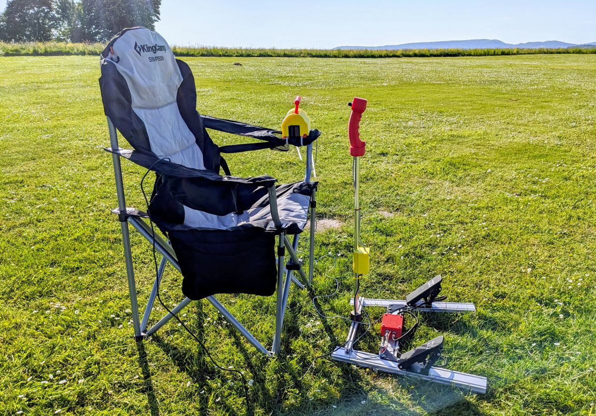
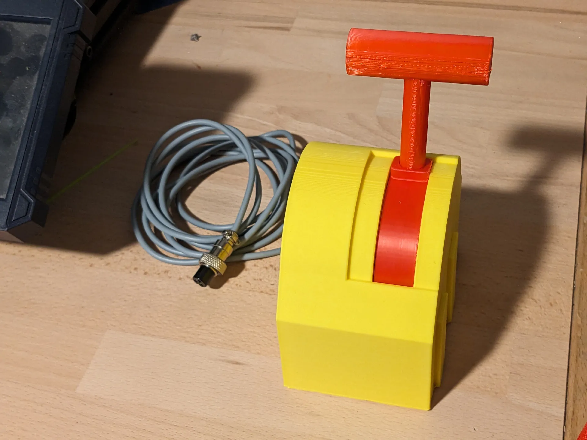
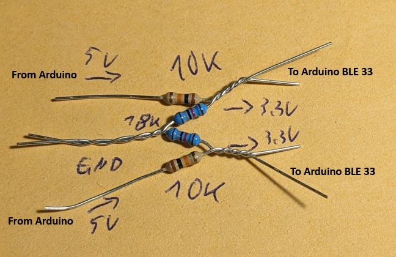
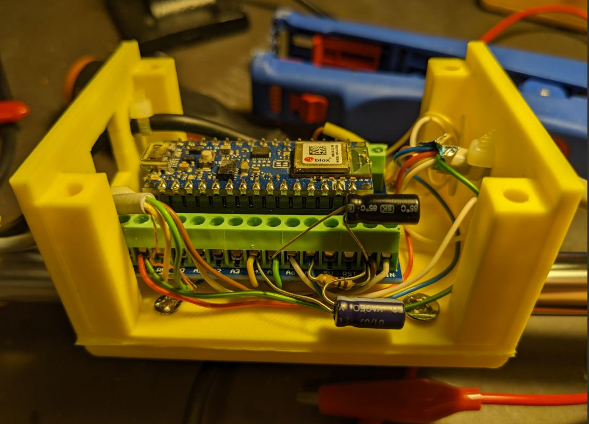

# FPV Cockpit

Soft and hardware for creating a functional cockpit used for controlling RC drones/planes with a flight stick and rudder pedals as well as a thrust lever. The project is based on the brilliant [Head Tracker](https://headtracker.gitbook.io/head-tracker) project. Brilliant because the Head Tracker software offers a lot of flexibility and enables the use case I describe here without any software modification... just parametrization via the nice Windows UI it comes with.

I use [Head Tracker](https://headtracker.gitbook.io/head-tracker) software in two Arduino Nano BLE 33. One for head tracking and one for capturing the flightstick movements as well as to ingest the analog values from the
* Rudder Pedal
* Thrust lever
* Flap Switch
* Trigger Switch

## Motivation
I [started to fly FPV with my regular RC planes](https://www.youtube.com/watch?v=oKpAUHD5oCo) (not drones!) in 2024. First by mounting the equipment in my [Acromaster](https://www.printables.com/de/model/872705-fpv-pan-tilt-and-air-unit-holder-for-acromaster-) and then into the [Draco](https://www.printables.com/de/model/913318-fpv-frame-for-draco-) It is so fascinating that I was thinking about how to improve the immersive effect even further (the [Head Tracker unit](https://fpvdogfight.com/products/tally-ho-2-prebuilt-head-tracker) for the goggles combined with a [Pan tilt unit](https://fpvdogfight.com/products/motionsic-b-a-g-badass-gimbal) already was a great thing to feel like being in the plane). 

**So what was missing was a real flight stick and pedals to control the plane! :-)**

## The result
**A pair of pedals** to control the [rudder](https://en.wikipedia.org/wiki/Flight_control_surfaces#Rudder) of the plane:

The red box contains an Arduino Nano which takes the analog signals from the pedals and subtracts them. So that if you press no pedals or both pedals fully, the plane rudders are centered. I know this is not 100% realistic but for controlling the plane with the feet it is fine and it is mechanically easy to make. Maybe I will change it later if the whole project has shown a good user experience. Initially there is a 60 seconds calibration phase where the box learns the ruder outputs for min and max position so you must press each pedal at least once in that 60 seconds.

**A thrust lever** which is used to control the engine speed and is connected to the red box of the pdal mixer as well to benefit from the calibration phase:

**A Flight stick** which is used to control the [ailerons](https://en.wikipedia.org/wiki/Aileron) as well as the [elevators](https://en.wikipedia.org/wiki/Elevator_(aeronautics)) of the plane. Connected to the stick is the yellow box which contains an Arduino Nano 33 BLE with the [Head Tracker](https://headtracker.gitbook.io/head-tracker) firmware to detect the angular motion of the stick. From there it goes via a cable into my remote control (e.g. Graupner MZ24) to control the actual airplane. The Arduino also ingests the analog signals from the thrust lever and rudder pedals as well as two buttons from the stick itself (e.g. to control flaps):

TODO image of the stick

# DYI Instructions
## Schematics
Now that you are hooked I will give you some details about how to bulid it yourself. Here are the schematics of the circuit:

## Rudder pedals
The pedals are powered with 5V directly from the Arduino and provide an analog output ranging from 0 to 5 volts. It can be directly connected to the Arduino Nano (not Nano 33 BLE!) as described in the schematics above. To create the red mixer box for interfacing the pedals as well as the thrust lever you need an Arduino Nano. The software for it is contained in the [rudder-pedal-mixer](rudder-pedal-mixer) folder of this repository. It mixes the position of the two pedals into one analog output.  After powering on you have 60 seconds time to push both ruder pedals as well as the thrust lever from min to max so that the min and max positions are trained and a normalized output signal from 0 to 5V is created. By doing so, you co not have to change parameters of the flight stick Arduino in case the output voltages of the sensors change (for whatever reason, e.g. other sensor, temperature, age).

You can find a simulation of the mixer software here: [Tinkercad](https://www.tinkercad.com/things/2neiTo0rGoT-fpv-cockpit-pedal-simulator?sharecode=ey8n8Ov3wl2lUscSnCaDHknVoDXJ0ObJyboztXSCAUs)

As the Arduino Nano 33 BLE of the Flight Stick (see below) requires 3.3 Volts (5 will kill it!!!) the setup requires a voltage divider circuit. Here is the assembly of the voltage divider that is soldered to the bottom right plug of the red box as shown above:

 
## Thrust lever
The thrust lever is printed and then the P3022-V1-CW360 is inserted. It provides the same interface as the rudder pedals (5V input and output).  

## Flight stick
The flight stick tracker is based on an [Arduino Nano BLE 33](https://store.arduino.cc/products/arduino-nano-33-ble-with-headers) according to the requirements of the [Head Tracker v2.1](https://headtracker.gitbook.io/head-tracker) project. It receives two types of signals:
- The Bluetooth signal from the other head tracker on my goggles (based on the same hardware and software) to capture the head movement for adjusting the camera on the plane.
- [4 Analog inputs](https://headtracker.gitbook.io/head-tracker/getting-started/wiring/analog-input) from the following sources:
  - Rudder pedals 
  - Thrust lever
  - Trigger button of flight stick
  - Potentiometer of flight stick (e.g. to adjust flaps)

On this image you see the two capacitors (C1 and C2) that are needed to smoothen the PWM signal of the pedal mixer Arduino: 

Without them the pedal and thrust position is jumping/flickering. i assume becaus it depends on the time point when the Analog-To-Digital (ADC) converter of the arduino starts reading the signal.

The flight stick also contains a push button connected between GND and D2 to [center the flight stick position](https://headtracker.gitbook.io/head-tracker/getting-started/wiring).

# Part list

## Hardware
### Rudder pedals
I use two of these as rudder pedals: [5V scooter pedal](https://www.amazon.de/XFUYI-Elektro-Scooter-Fu%C3%9Fpedal-Gasgriff-E-Elektro-Dreirad-Pedal-Geschwindigkeitsregelung-Braun/dp/B0DZCVHP1T/ref=sr_1_52?__mk_de_DE=%C3%85M%C3%85%C5%BD%C3%95%C3%91&crid=1AF7EJG1U2Q8Q&dib=eyJ2IjoiMSJ9.0zo3uY2syh4c520tf6m-wx2U24Q27wWn2Y6a9vBiXjw26Ukakg27CDL59ZUhxyvHg3t4bipouGHzhsgzciDN3QyfNE_a5mj5hg54hcWFHmIO2fspOHSD_cFuyrQN6Sb5zM9uoIgV5NSL0Ee8SIC2dWLel4ODeAQJa-fDfLHWdtYFjavNMAnKJ2LuDS6dj8QMcucVpfrAnThVmA-x65RubmEKHFya8YazTCQIy0pZLpew46xIV-phQhXBz4gUkmtGIetZRRSXLr2y6V3aLY-sfqvpp4iDX7w9OYCuG3DY4ZM.uREC5iUgX4aYnahMFY9sXlDJ5pyNyYcXpcXJsZi-2Uw&dib_tag=se&keywords=5v+scooter+pedal&qid=1745588133&sprefix=5v+scoote+rpeda%2Caps%2C133&sr=8-52)

And then I use a https://store.arduino.cc/en-de/products/arduino-nano to mix the two analog signals. You can find the source code in the folder 'rudder-pedal-mixer'

### Flight Stick position sensor
I used an https://store.arduino.cc/products/arduino-nano-33-ble-with-headers and programmed it with the https://headtracker.gitbook.io/head-tracker software via the windows GUI. Just connect via USB and upload the firmware. Not need for a separate bootloader upfront.

### Thrust lever
I use an P3022-V1-CW360 angular sensor and fitted it into the 3D model described below: https://de.aliexpress.com/item/1005005806329401.html?gatewayAdapt=glo2deu

## 3D models
### Rudder pedals
[Box for Arduino based mixer unit](https://www.printables.com/model/1281219-case-for-arduino-nano-breakout-board)

### Flight stick
I modified [this model](https://www.printables.com/model/202391-digital-arcade-flightstick-3-the-raptor-stl-versio) so that only 1 slot (also a bit bigger inside) for adding a potentiometer (to adjust the flaps, for example) is printed. You can find [my flight stick here](https://www.printables.com/model/1276597-flight-stick-for-real-fpv-rc-cockpit) 

Furthermore you can use [this 3D model](https://www.printables.com/model/1287979-case-for-arduino-nano-33-ble-for-my-rc-fpv-flight) to fit the Arduino Nano 33 BLE of the [Head Tracker 2.1 project](https://headtracker.gitbook.io/head-tracker) into a case that can be mounted to the tube of the flight stick so that it detects the flight stick motions.

### Thrust lever
I used [this model](https://www.printables.com/model/903412-big-lever) as a basis for [my version of the thrust lever chassis](https://www.printables.com/model/1281225-thrust-lever-for-rc-fpv-cockpit) which fits with the angular sensor mentioned above.
 

